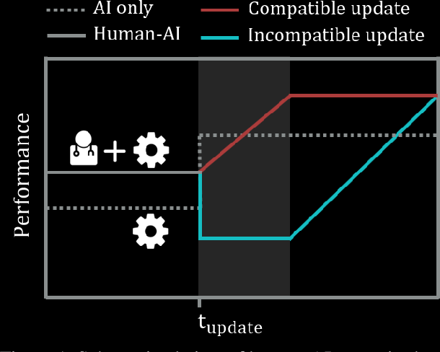

# HumanAgentInteraction-Project
Improve the performance-compatibility tradeoff using individualized objective functions under the context of human-agent interaction.

**The Problem**

In response to the user's interaction with the AI system, two processes occur. Initially, the user formulates some expectations about the capabilities 
of the system based on the quality of its recommendations. In addition, the system collects more data and can update its prediction model.
As much as updating the model can improve the system's performance, it can also alter the system's way of making predictions, which the user may not
expect based on past interactions. As a result, although the update improves overall performance, it may not be compatible with the user's expectations.

After the update there is a split into two options; The blue Line represents when the update is performed without maintaining compatibility with the old model.
When that occurs, performance may be impaired both concerning specific areas like identifying moles on the face and how the user understands those changes.
The red Line is when the update maintains compatibility with the previous model, the performance is guaranteed to grow.

**The methodology of Improve the performance-compatibility tradeoff using individualized objective functions**

The following methodology for  improving the Performance-Compatibility Tradeoff  shown by  J. Martinez et al. (2021), the authors of Improving the Performance-Compatibility Tradeoff with Personalized Objective Functions. Martinez et al. (2021), suggest a method of altering objective functions so that high performance is maintained without compromising user trust.
* Create 9 models that represents a weights vector
* Divide the dataset by users
* Run a nested cross validation process
* Show the best model by plotting the AUTC

**Under the context of human-agent interaction**

By using this approach, we seek to improve the interaction between human-agent and improve user confidence in the decision-making assistance system. The code, models, and datasets will also be discussed, as well as the results and conclusions.
By using their method, the system will be able to make decisions that are more personalized for each user. Interactions between humans and machines will improve, leading to a more personalized experience for users. We also try to improve their method to make it more effective.

**Methods And Materials:**

In order to test the method, the authors applied it to domains that are commonly used in Human-Computer Decision Making. The chosen domains are following the next criteria:
* include multiple interactions between users and the system.
* the system makes decisions in real-time. 
* the system could be used to assist in user decision-making.
To conduct the empirical experiment, three domains were selected according to the above-mentioned criteria ASSISTments , CitizenScience  and MOOCPosts .

**Code**

The three domains were tested via code. The code uses 3 classifiers: Decision Tree Classifier, Random Forest Classifier, and Xgboost Classifier, and applies them to each domain. In the code, data is divided according to users, and nested loops make sure the results are statistically accurate, whereas the internal loop is used to choose the best model. Thus, in the internal loop each sample is given weights that correspond to the model being studied, and this is done by initializing the weight parameter of the chosen classifier based on the weight of the model.
* Runner.py - This module represents the starting point of the code; it contains the main function and some other classes and functions responsible for init time and saving results to log files. 
* NestedCrossValidation.py - This module called by Runner.py and responsible to create and perform the nested cross validation process on the chosen dataset. 
* ExperimentSettings.py - This module allows you to specify how the experiment should be configured, including which data set should be analyzed with the specified parameters, as well as the files path.
* DataPreparation.py - This module takes care of preparing the preexisting data for the AI algorithm using the calculated and prepared parameters. Also, creating the files and folders necessary for running the data.
* Models.py - This module provides parameters evaluation and modeling functionality, including model fitting, model prediction, score, etc.  Initialization includes the desired model as well as optional parameters.
* AnalyseResults.py  - This module is responsible for processing the results, analyzing and presenting them visually for the purpose of comparing and examining the personal approach in relation to the baseline solution.

**Discussion**

Unlike J. Martinez et al, we tested the method with Random Forest and Xgboost as well as Decision Tree. Our decision to use a Random Forest is based on the following reasons: One, Random Forests are considered a highly accurate and robust method due to the number of decision trees participating in the process. It does not suffer from the overfitting problem. It averages all predictions, reducing the biases. Moreover, as for Random Forests, they combine predictions from many decision trees.  The logic is that even a single model made up of many mediocre ones will still be better than a single great one. 
Our decision was also to extend this test to Xgboost since Random Forest is what we call bagging applied to decision trees (reduce variance through bagging), which keeps the model relatively stable even if the data changes, Xgboost based on Boosting. Boosting reduces variance and bias.    Due to the use of multiple models (bagging), it reduces variance. It reduces bias by training the subsequent model by telling him what errors the previous models made (the boosting part). Since the algorithm includes Boosting, it would seem to be better than random forest.

**Evaluating the empirical findings**

* As observed on these datasets, the results indicated that the Martinez et al. method consistently provides better results than the baseline model [not in all cases, but in most]. 
* As can be seen from the results of the CitizenScience and MOOCPosts datasets, the results are significantly improved when using more complex models like Random Forest and Xgboost for these datasets.
* We found that the area below the AUTC increases when we use better models rather than when we use decision trees, which further improves the Martinez et al. method of improving performance-compatibility using individualized objective functions.

**Conclusions**
Based on the results of the empirical experiments, the method certainly contributes to improving the trade-off between performance-compatibility. Furthermore, regarding the  Martinez et al. method, we demonstrated that other machine learning models like Random Forest and Xgboost can improve the method used by  Martinez et al. at the empirical experiments and achieve better results than necessarily the Decision Tree model. 
Solving the compatibility-performance tradeoff problem improve human-agent interactions, since improvements for one user will not reduce compatibility-performance for another. Consequently, implementing the Martinez et al. solution of personalizing the objective function assures high performance without compromising the user's trust in the system, and can certainly improve human-agent interaction, and enhance user confidence in the decision-making assistance systems. 

